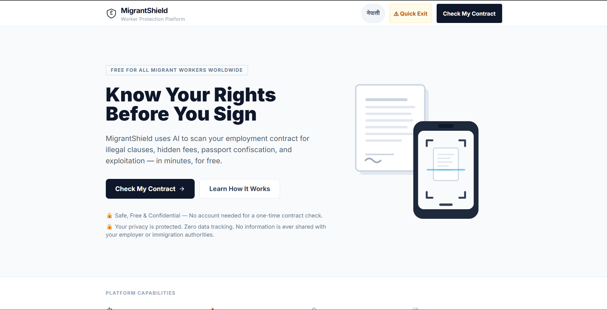
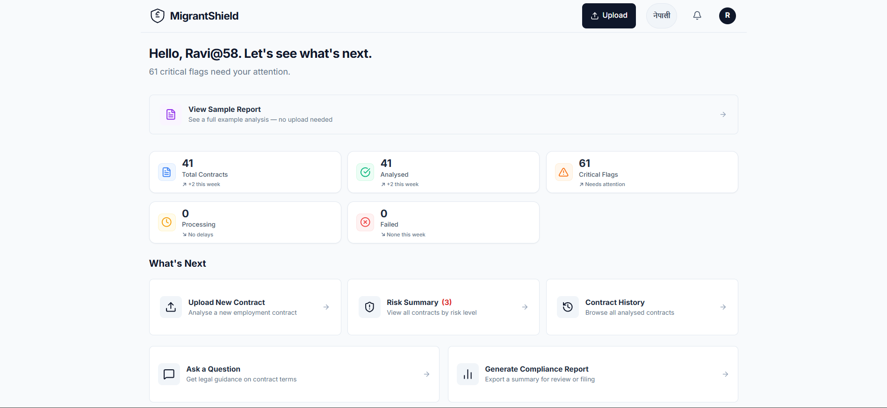
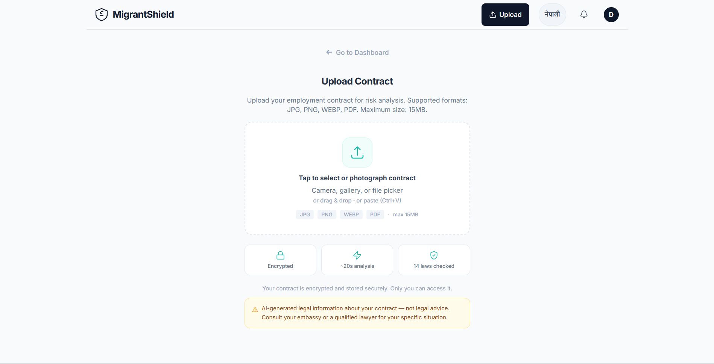
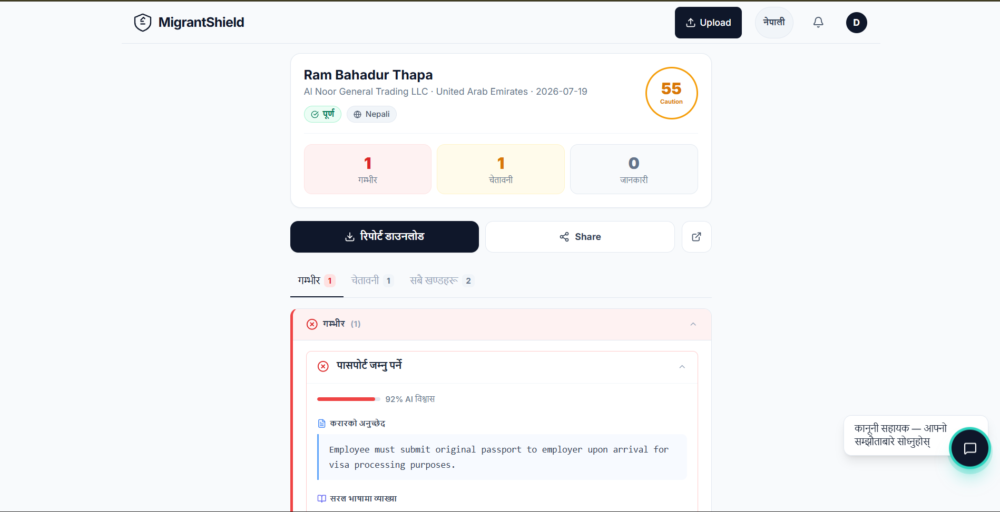
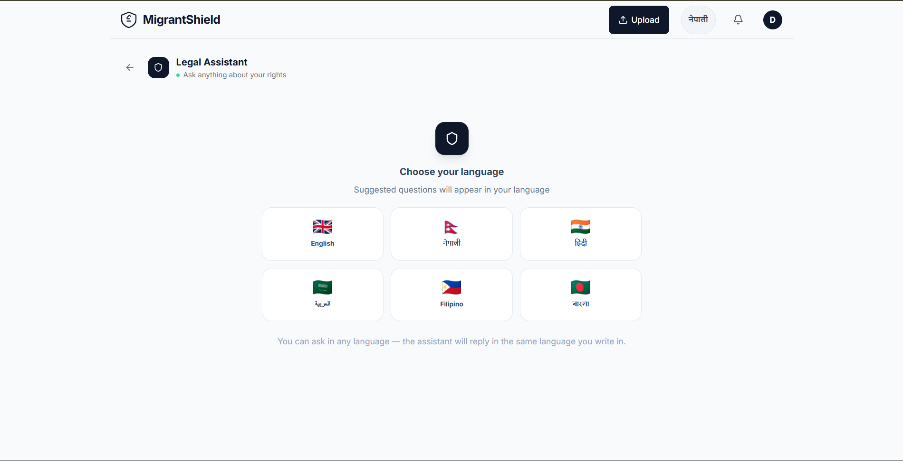
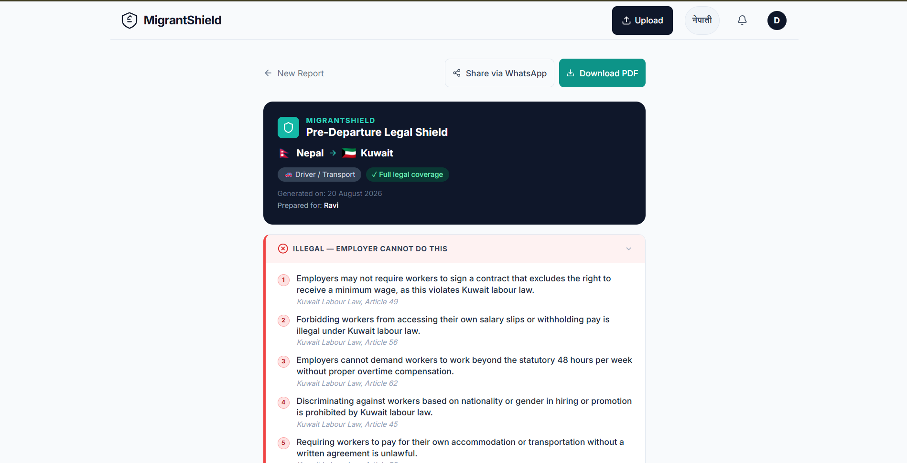

<div align="center">


# MigrantShield

**AI-Powered Contract Protection for Migrant Workers**

Know what's illegal in your contract — before you sign, in your own language.

[](https://migrant-shield.vercel.app)
[](https://migrant-shield.vercel.app)
[](https://groq.com/)

[](https://nextjs.org/)
[](https://www.typescriptlang.org/)
[](https://fastapi.tiangolo.com/)
[](https://www.python.org/)
[](https://supabase.com/)
[](https://vercel.com/)
[](LICENSE)


</div>
_______________________________________________________________________________________________________________________________________________________

## Why this exists

Hundreds of thousands of workers leave Nepal, India, the Philippines, and Bangladesh every year for jobs in the Gulf and Southeast Asia — most without a lawyer, often without fully understanding the contract they're signing.

Recruitment agencies routinely bury:
- Illegal recruitment fees
- Passport confiscation clauses
- Wage theft terms
- Rights-stripping fine print

...inside paperwork that looks completely normal.

**MigrantShield closes that gap.** Upload a contract — or answer four questions before you even have one — and get back, in your own language:

- What's illegal and unenforceable
- What rights you actually have
- What to demand before signing
- Who to call if it goes wrong

All grounded in the real labour law of the destination country — not a generic AI guess.

_______________________________________________________________________________________________________________________________________________________

## Screenshots

| Landing | Dashboard |
|---|---|
|  |  |

| Upload | Report Analysis |
|---|---|
|  |  |

| Ask a Question | Pre-departure Wizard |
|---|---|
|  |  |

_______________________________________________________________________________________________________________________________________________________
## What it does

| Capability | Description |
|---|---|
| 📄 **Contract Analysis** | Upload a PDF/image → jurisdiction auto-detected → clause-by-clause risk breakdown, grounded in retrieved labour law, via Groq LLaMA 3.3 70B |
| 🛡️ **Pre-departure Legal Shield** | A 4-step wizard generates a full rights report before a worker even has a contract — illegal clauses, rights, a pre-signing checklist, corridor-specific risks, embassy contacts, downloadable as PDF |
| 💬 **Ask the Contract** | Follow-up chat scoped to a specific analysed contract, or general labour-law questions |
| 🧑‍⚖️ **Human Review Escalation** | Ambiguous or high-risk contracts get queued for a human legal reviewer instead of a confident-sounding wrong answer |
| 🔗 **Shareable Reports** | Tokenised share links, so a worker can send their report to family or an advocate without giving away account access |
| 👤 **No Account Required** | Guest uploads work immediately, rate-limited and auto-expiring — the account is for people who want to keep a history, not a gate to entry |
| 🌐 **Six Languages** | English, Nepali, Hindi, Arabic, Filipino, Bengali |
| 🔑 **Passwordless Auth** | Email OTP, with fast account switching so a shared device doesn't mean re-verifying every time |

_______________________________________________________________________________________________________________________________________________________
## Results

> Numbers below are counted from the codebase and measured directly — no estimates.

- ✅ **8** labour-law jurisdictions covered (Kuwait, Oman, UAE, Saudi, Qatar, Malaysia, Nepal, Philippines)
- ✅ **6** supported languages (English, Nepali, Hindi, Arabic, Filipino, Bengali)
- ✅ **14** REST endpoints across 5 categories (see API reference)
- ✅ **529** legal chunks indexed in pgvector
- ✅ **~8s** average PDF analysis time
- ✅ **~10s** average image analysis time
- ✅ **RAG-grounded** — every clause verdict cites retrieved source law, not model memory

_______________________________________________________________________________________________________________________________________________________
## How it works
```
 Upload — FastAPI (Render)
   You upload a contract (PDF or photo). File is stored
   in Supabase Storage.
         ↓
 Queue — ARQ + Redis
   The job goes into a background queue, so it's never
   lost even if something crashes mid-analysis.
         ↓
 Read the document — PyMuPDF
   Text is pulled out of the file.
         ↓
 Detect the country — Groq LLaMA 3.3 70B
   The employer's country is detected automatically.
         ↓
 Find the relevant law — pgvector
   The system searches a database of real labour laws
   (multilingual embeddings over 8 countries + ILO conventions)
   and pulls only the sections that match that country.
   This is the RAG retrieval step.
         ↓
 Analyse the contract — Groq LLaMA 3.3 70B
   The AI compares your contract against that real law —
   not a guess, actual legal text — and flags what's risky.
   This is the RAG generation step.
         ↓
 Generate the report — ReportLab
   A clause-by-clause PDF report is created, with rights
   and law citations.
         ↓
 Done — Supabase Realtime
   Report is saved and pushed to you live, no refreshing needed.
```

_______________________________________________________________________________________________________________________________________________________

## Why I built it this way

| Area | Approach | Reasoning |
|---|---|---|
| **Jurisdiction detection** | A cheap Groq call identifies the employer's country first, before any retrieval | Retrieving across all 8+ countries' labour law and letting the LLM sort it out produced noisier, less-grounded answers — narrowing the search space first gave more precise citations |
| **Vector search** | pgvector — `psycopg2` direct connection to Postgres, not a separate service like Pinecone/Weaviate | The corpus is small and single-tenant (labour law doesn't change per-request) — one fewer service to run, deploy, and pay for, with no real performance cost at this scale |
| **Embeddings** | Multilingual — `sentence-transformers` (`paraphrase-multilingual-MiniLM-L12-v2`), not English-only | Contracts and worker questions arrive in six languages; an English-only model would silently degrade retrieval quality for non-English input |
| **Access model** | Guest mode — no account required, images tried inline before falling back to the queue | The people this tool serves are the least likely to make an account before they trust a service — removing that friction mattered more than consistency of the processing path |
| **Job processing** | ARQ + Redis — a real job queue, not FastAPI `BackgroundTasks` | Contract analysis can take long enough that a worker crash mid-request would silently lose the job — a queue survives restarts; in-process background tasks don't |
| **Auth** | Supabase JWKS verification, not a shared secret | Avoids storing a duplicate signing secret in the backend; token verification stays correct even if Supabase rotates keys |
| **Uncertain cases** | Human review escalation, not just a lower confidence score | A wrong "this is safe" from an LLM is worse than no answer — this is legal information affecting someone's livelihood, so uncertain cases get routed to a human instead of shipped with false confidence |
_______________________________________________________________________________________________________________________________________________________
## Legal corpus

Retrieval is grounded in actual source law, not the model's training data:

| Source | What it covers |
|---|---|
| ILO Conventions 29, 105, 143, 189 | International baseline — forced labour, migrant worker rights, domestic worker protections |
| Kuwait Labour Law (2010) | Working hours, wages, termination, kafala-related employer obligations |
| Oman Labour Law (2003) | Contract terms, leave entitlements, end-of-service benefits |
| UAE Labour Law (2021) | Post-reform rules — fixed-term contracts, gratuity, anti-discrimination |
| Saudi Labour Law | Wage protection, working conditions, contract termination rules |
| Qatar Labour Law (+ 2017 amendment) | Post-kafala-reform rules — exit permits, wage protection system |
| Malaysia Employment Act (1955) | Minimum standards for wages, hours, and termination |
| Nepal Foreign Employment Act (2007) | Nepal-specific recruitment agency regulation and worker protections |
| Philippines POEA Rules + Standard Employment Contract | Mandatory minimum contract terms for overseas Filipino workers |

---

_______________________________________________________________________________________________________________________________________________________
## Tech stack

### Frontend

| Technology | Purpose |
|---|---|
| Next.js 14 (App Router) | React framework with SSR |
| TypeScript | Type-safe frontend code |
| Tailwind CSS | Utility-first styling |
| Supabase JS / SSR / Auth Helpers | Auth, session, and data client |
| lucide-react | Icon system |
| jsPDF + html2canvas | Client-side PDF generation |

### Backend

| Technology | Purpose |
|---|---|
| FastAPI | REST API |
| ARQ + Redis | Background job queue |
| PyJWT | JWKS-based token verification |

###AI pipeline

| Technology | Purpose |
|---|---|
| Groq SDK | LLM inference (LLaMA 3.3 70B) |
| PyMuPDF | PDF text extraction |
| sentence-transformers | Multilingual embeddings for RAG |
| psycopg2 + pgvector | Direct vector search over Postgres |
| ReportLab | PDF report rendering (Noto Sans / Devanagari fonts) |

### Infra

| Technology | Purpose |
|---|---|
| Vercel | Frontend deployment |
| Render | Backend deployment |
| Supabase | Postgres, Auth, Storage, Realtime |
| Redis (Upstash) | Job queue |
| UptimeRobot | Keep-alive pings, prevents free-tier sleep |

---


_______________________________________________________________________________________________________________________________________________________
## Project structure

```
Migrant_Shield/
├── backend/
│   ├── main.py                     # FastAPI app — all routes registered here
│   ├── worker.py                   # ARQ job: extract → detect → retrieve → analyse
│   ├── tasks.py                    # ARQ task definitions
│   ├── jurisdiction_detector.py    # Groq-based employer-country detection
│   ├── groq_utils.py               # Shared Groq client helpers
│   ├── retriever.py                # pgvector semantic search over legal_chunks
│   ├── rag.py                      # RAG retrieval/generation helpers
│   ├── pdf_generator.py            # ReportLab report rendering
│   ├── ingest_corpus.py            # Chunk legal_corpus/*.pdf into legal_chunks
│   ├── embed_chunks.py             # Generate + store chunk embeddings
│   ├── database/                   # DB connection + query helpers
│   ├── legal_corpus/               # Source labour-law PDFs
│   ├── fonts/                      # Multilingual PDF fonts
│   ├── rls_policies.sql            # Row Level Security
│   └── start.sh                    # Render start script
│
└── frontend/src/
    ├── app/
    │   ├── dashboard/                       # Contract overview, stats, activity
    │   ├── auth/phone/, auth/verify/        # Email OTP login
    │   ├── upload/, upload/preview/, upload/processing/
    │   ├── report/[id]/
    │   │   ├── page.tsx                     # Report view
    │   │   ├── detail/[issue_id]/           # Single-flag detail
    │   │   ├── print/                       # Print-friendly report
    │   │   └── share/[token]/               # Public shared view
    │   ├── compliance-report/, .../print/   # Pre-departure wizard
    │   ├── history/, risk-summary/, chat/
    │   ├── admin/review/[review_id]/        # Human review queue
    │   ├── failed/                          # Failed analysis state
    │   ├── reset-password/                  # Password reset flow
    │   └── settings/, help/, about/, partners/, privacy/, terms/
    ├── components/     # GlobalHeader, BottomNav, SeverityBadge, ConfidenceBar, FileUploadProgress…
    ├── context/         # AuthContext, ThemeContext, ToastContext
    └── lib/             # Supabase clients (supabase/), i18n, mockData
```


_______________________________________________________________________________________________________________________________________________________
## Production Environment Variables

### Backend (`backend/.env`)

```env
# Supabase
SUPABASE_URL=your_supabase_url
SUPABASE_SERVICE_KEY=your_supabase_service_key
SUPABASE_JWT_SECRET=your_supabase_jwt_secret

# Database (direct connection)
DATABASE_URL=your_postgres_connection_string

# App
FRONTEND_URL=http://localhost:3000

# Redis
REDIS_URL=your_redis_url
UPSTASH_REDIS_REST_URL=your_upstash_redis_rest_url
UPSTASH_REDIS_REST_TOKEN=your_upstash_redis_rest_token

# Groq API keys (rotated across free-tier limits)
GROQ_API_KEY=your_groq_api_key
GROQ_API_KEY_1=your_groq_api_key_1
GROQ_API_KEY_2=your_groq_api_key_2
GROQ_API_KEY_3=your_groq_api_key_3
CHAT_GROQ_API_KEY=your_chat_groq_api_key

# Storage
SUPABASE_BUCKET=migrantshield-contracts

# Email
SENDGRID_API_KEY=your_sendgrid_api_key

# Admin / Demo
ADMIN_USER_ID=your_admin_user_id
DEMO_CONTRACT_ID=your_demo_contract_id
```

### Frontend (`frontend/.env.local`)

```env
NEXT_PUBLIC_SUPABASE_URL=your_supabase_url
NEXT_PUBLIC_SUPABASE_ANON_KEY=your_supabase_anon_key
NEXT_PUBLIC_API_URL=http://localhost:8000
NEXT_PUBLIC_ADMIN_USER_ID=your_admin_user_id
CHAT_GROQ_API_KEY=your_chat_groq_api_key
```

---

_______________________________________________________________________________________________________________________________________________________
## Running it locally

### Prerequisites

```
Node.js v18+
Python 3.10+
Git
A Supabase project with pgvector enabled
Redis
A Groq API key
```

### 1. Clone

```bash
git clone https://github.com/RaviBist18/Migrant_Shield.git
cd Migrant_Shield
```

### 2. Backend

```bash
cd backend
python3 -m venv venv && source venv/bin/activate   # Windows: venv\Scripts\activate
pip install -r requirements.txt
```

Set up `backend/.env` — see [Environment Variables](#environment-variables) below.

### 3. Ingest Legal Corpus

```bash
python ingest_corpus.py   # chunk legal_corpus/*.pdf into legal_chunks
python embed_chunks.py    # generate + store embeddings
```

### 4. Run Backend

```bash
uvicorn main:app --reload --port 8000
```

### 5. Frontend

```bash
cd frontend
npm install
```

Set up `frontend/.env.local` — see [Environment Variables](#environment-variables) below.

```bash
npm run dev
```

---


_______________________________________________________________________________________________________________________________________________________

## API Endpoints

### Auth (`/auth`)

| Method | Endpoint | Description |
|---|---|---|
| POST | `/otp/request` | Request email OTP |
| POST | `/otp/verify` | Verify OTP, start session |

### Contracts

| Method | Endpoint | Description |
|---|---|---|
| POST | `/upload` | Upload a contract — auth optional |
| GET | `/status/{contract_id}` | Poll analysis status |
| POST | `/contracts/{contract_id}/reanalyze` | Retry a failed analysis |

### Reports

| Method | Endpoint | Description |
|---|---|---|
| GET | `/report/{contract_id}` | Get report |
| GET | `/report/{contract_id}/pdf` | Download report as PDF |
| POST | `/report/{contract_id}/chat` | Ask questions about this contract |
| POST | `/report/{contract_id}/share` | Create a share link |
| DELETE | `/report/{contract_id}/share` | Revoke a share link |
| GET | `/shared/{share_token}` | View a shared report (public) |

### Compliance (`/api/compliance-report`)

| Method | Endpoint | Description |
|---|---|---|
| POST | `/generate` | Generate the pre-departure report |
| POST | `/api/chat` | General labour-law Q&A |

### Admin (`/admin/review`)

| Method | Endpoint | Description |
|---|---|---|
| POST | `/review/request` | Escalate to human review |
| GET | `/queue` | List pending review items |
| GET | `/{review_id}` | Get single review item |

Every ownership-scoped route verifies the caller's Supabase JWT against JWKS and checks `user_id` on the underlying row before returning data.

---


## Current Scope

- Coverage currently includes the listed labour corridors. Other destinations fall back to ILO standards and are clearly marked as partial coverage.
- OCR for scanned/blurry images isn't in place yet — image uploads work best with a clear photo, not a scan.
- Image analysis is currently slower than PDF analysis — an active optimization target.
- MigrantShield provides legal guidance, not legal representation. High-risk or ambiguous cases are escalated for human review.

---

## Disclaimer

MigrantShield provides AI-generated guidance, not legal advice. Always verify critical information with your embassy or a qualified legal professional before signing anything.

_______________________________________________________________________________________________________________________________________________________
## License

MIT — see [LICENSE](LICENSE) for details.

_______________________________________________________________________________________________________________________________________________________
## Author

**Ravi Bist**

[](https://github.com/RaviBist18)
[](https://www.linkedin.com/in/ravi-bist-vk1418)

---

<div align="center">

**MigrantShield** — Know your rights before you sign.

*Free for the workers who need it most.*

</div>


